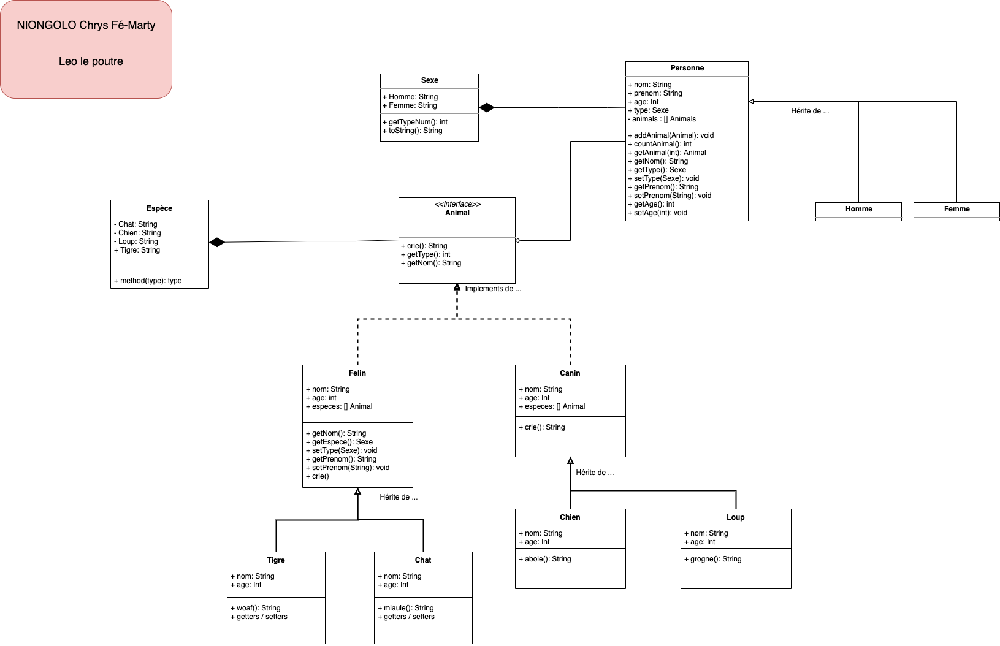

## Travail de maison

Travail à faire pour demain :
1. Créer deux classes : Canin et Felin
  * un Canin aboit()
  * un Felin miaule()
  * les deux implements Animal, donc faite en sorte que crie() fonctionne
2. Associé Chien à Canin
  * modifié crie() par aboit() (pensez à l'Override)
3. Associé Chat à Felin
  * modifié crie() par miaule() (pensez à l'Override)
4. Créer deux autres classes Loup et Tigre
5. Faite la bonne association entre Canin et Felin

## Diagramme de classe
